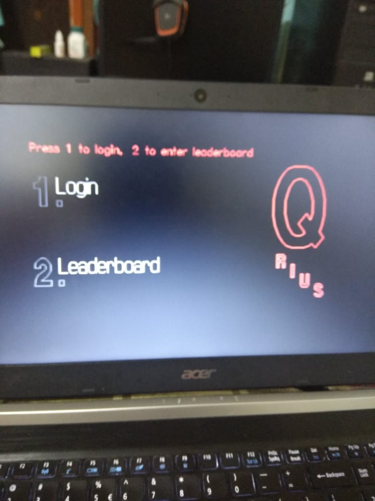
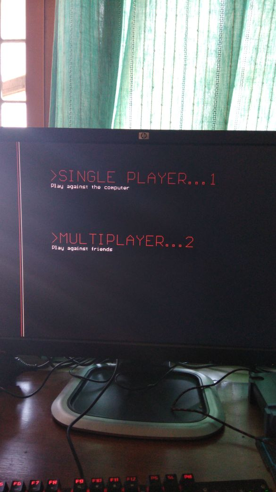
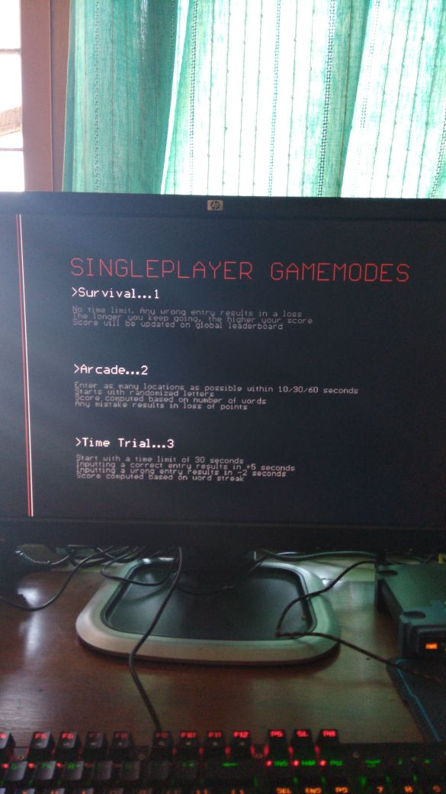
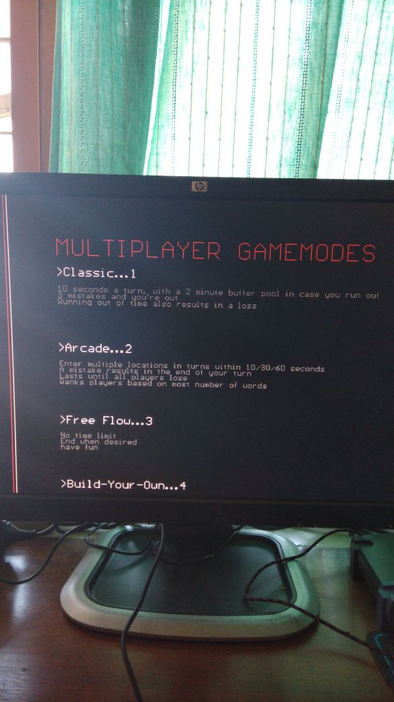
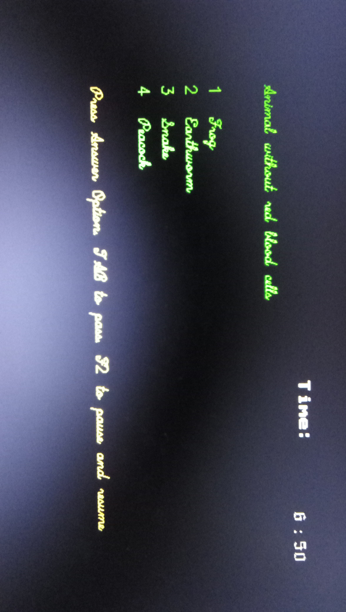
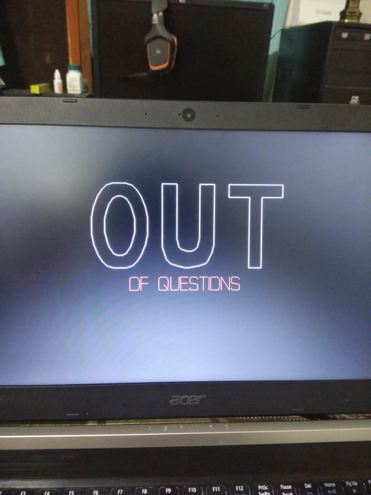
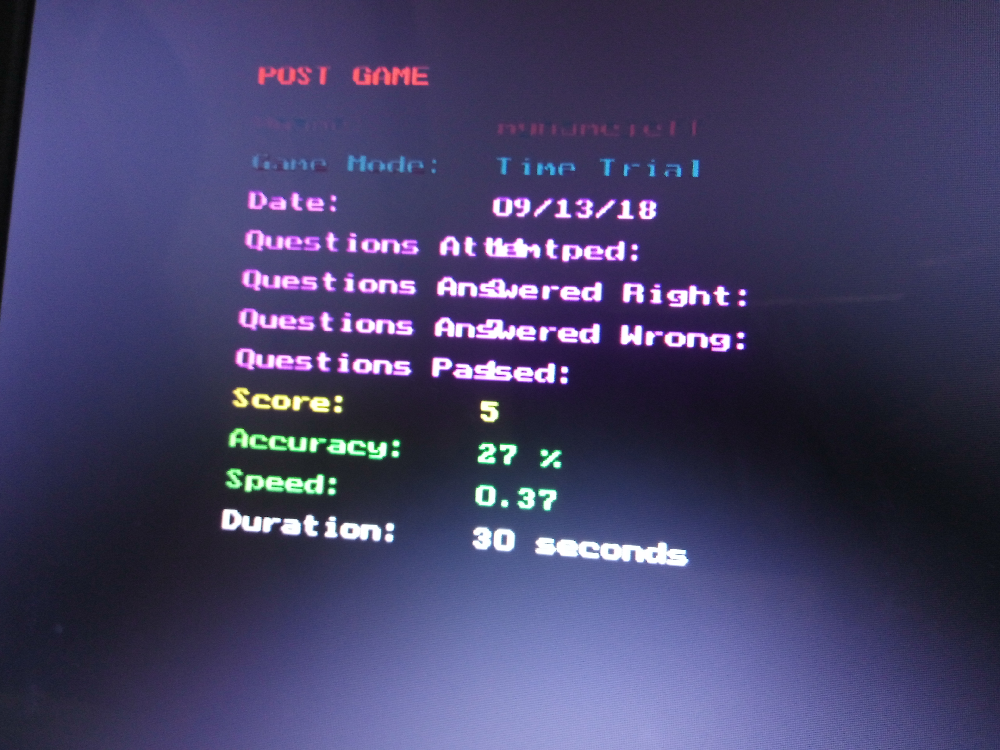
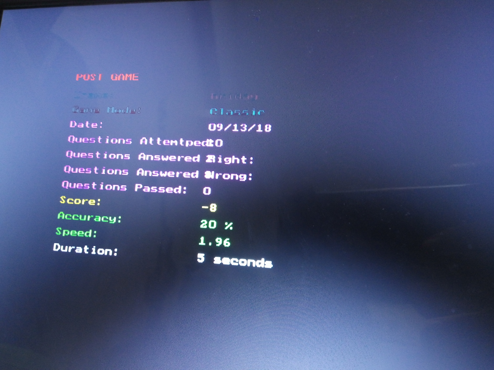

# QRius

A quiz game that tried to be more than a boring CLI question answer prompt. This was my first coding project. Uploaded to github for archival.

Here are some of the 'screenshots' I could recover (forgive the poor quality ;)

